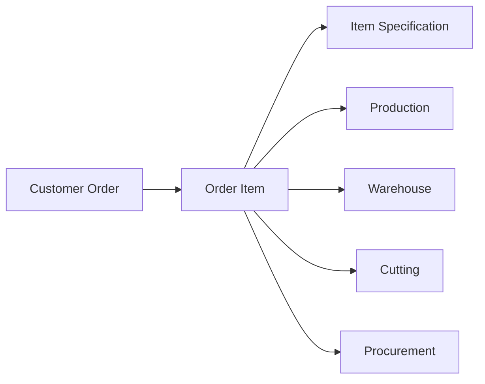
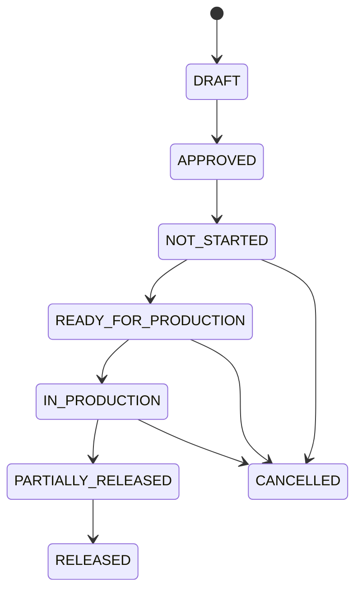

# Order Management Specification

**Document ID:** TMP-SPEC-010
**Status:** Accepted
**Version:** 1.0

---

# 1. Назначение

Order Management — функциональная область TOP Manufacturing Platform (TMP), отвечающая за управление жизненным циклом заказов клиентов, позиций заказов и спецификаций изделий.

Order Management является единственным владельцем заказов клиентов, позиций заказов и их спецификаций.

Главным объектом платформы является **позиция заказа**.

Именно позиция заказа является источником данных для Production, Warehouse, Cutting, Procurement и других Capability.

---

# 2. Цели Order Management

Order Management обеспечивает:

* единое хранение заказов клиентов;
* управление жизненным циклом заказа;
* управление жизненным циклом позиции заказа;
* хранение коммерческой информации;
* хранение производственной информации позиции;
* формирование неизменяемой спецификации изделия;
* предоставление данных другим Capability;
* управление изменениями заказа;
* прослеживаемость изменений;
* полную совместимость с документной моделью TMP.

---

# 3. Область ответственности

Order Management отвечает за:

* заказы клиентов;
* позиции заказов;
* спецификации позиций;
* коммерческие параметры;
* количество изделий;
* редакции позиций;
* статусы заказов;
* статусы позиций;
* ссылки на связанные документы;
* связи между версиями позиций;
* предоставление данных другим Capability;
* бизнес-правила изменения заказов.

Order Management является единственным владельцем:

* Customer Order;
* Order Item;
* Item Specification;
* Revision History;
* коммерческих данных заказа.

---

# 4. Что не входит в Order Management

Order Management не отвечает за:

* складские остатки;
* резервирование материалов;
* складские операции;
* закупку материалов;
* поставщиков;
* производственное планирование;
* запуск производства;
* выпуск изделий;
* карты раскроя;
* оптимизацию раскроя;
* производственную аналитику;
* контроль качества;
* транспортировку;
* финансовый учёт;
* расчёт заработной платы.

Order Management также не изменяет:

* производственные статусы;
* складские состояния;
* складские документы;
* партии материалов;
* движения материалов.

Эти данные принадлежат соответствующим Capability.

---

# 5. Основные архитектурные принципы

1. Главным производственным объектом платформы является **позиция заказа**.
2. Заказ клиента является контейнером коммерческой информации.
3. Производство работает исключительно с позициями заказа.
4. Warehouse работает исключительно с позициями заказа.
5. Cutting работает исключительно с позициями заказа.
6. Спецификация позиции является единственным источником данных о составе изделия.
7. После утверждения спецификация становится неизменяемой.
8. Изменение изделия выполняется созданием новой версии позиции либо новой позиции.
9. Проведённые документы не изменяются.
10. Вычисляемые состояния не хранятся, если могут быть вычислены.
11. Order Management не владеет складскими остатками.
12. Order Management не владеет производственными документами.
13. Order Management предоставляет данные другим Capability только через Public API.

---

# 6. Общая модель



Главным объектом взаимодействия между Capability является **Order Item**.

---

# 7. Customer Order

Customer Order представляет собой коммерческий документ, объединяющий позиции заказа.

Заказ используется исключительно для хранения информации общего уровня.

Производственные операции выполняются не над заказом, а над его позициями.

---

# 7.1 Атрибуты Customer Order

Обязательные атрибуты:

| Атрибут       | Назначение                      |
| ------------- | ------------------------------- |
| ID            | Уникальный идентификатор        |
| Номер         | Уникальный номер заказа         |
| Заказчик      | Клиент                          |
| Договор       | Основание выполнения            |
| Объект        | Строительный объект             |
| Дата          | Дата оформления                 |
| Ответственный | Менеджер                        |
| Направление   | Частное / дилер / корпоративный |
| Валюта        | Валюта расчётов                 |
| Статус        | Статус заказа                   |

---

# 7.2 Что хранится в заказе

Заказ хранит:

* сведения о клиенте;
* коммерческие условия;
* договор;
* адрес объекта;
* сроки;
* список позиций;
* ссылки на связанные документы;
* комментарии.

Заказ не хранит:

* производственную спецификацию;
* материалы;
* карты раскроя;
* складские остатки;
* резервы;
* партии материалов.

---

# 8. Order Item

Order Item является главным объектом всей платформы.

Каждая позиция представляет самостоятельное изделие или самостоятельную группу одинаковых изделий.

Все производственные процессы работают именно с Order Item.

Production не работает с Customer Order напрямую.

Warehouse не работает с Customer Order напрямую.

Cutting не работает с Customer Order напрямую.

---

# 8.1 Атрибуты Order Item

| Атрибут                  | Назначение                 |
| ------------------------ | -------------------------- |
| ID                       | Уникальный идентификатор   |
| Order                    | Родительский заказ         |
| Код изделия              | Код изделия                |
| Наименование             | Наименование               |
| Количество               | Количество изделий         |
| Спецификация             | Ссылка на спецификацию     |
| Производственные статусы | Производственное состояние |
| Версия                   | Номер редакции             |
| Активность               | Актуальность позиции       |

---

# 8.2 Правила Order Item

Каждая позиция:

* принадлежит одному заказу;
* имеет одну спецификацию;
* имеет собственный жизненный цикл;
* имеет собственные производственные статусы;
* может участвовать в производстве независимо от других позиций заказа;
* может иметь собственную карту раскроя;
* может выпускаться частично;
* может быть отменена независимо от других позиций.

> **Architecture Rule**
> Именно позиция заказа является единицей производства, склада и снабжения.

---

# 9. Item Specification

Item Specification определяет полный состав изделия.

Спецификация является частью позиции заказа.

Спецификация используется:

* Production;
* Warehouse;
* Cutting;
* Procurement;
* другими Capability.

Все Capability используют одну и ту же спецификацию.

---

# 9.1 Состав спецификации

Спецификация содержит:

* перечень материалов;
* количество каждого материала;
* единицы измерения;
* нормы расхода;
* производственные параметры;
* служебные характеристики.

Спецификация не содержит:

* складские остатки;
* партии;
* складские состояния;
* производственные документы;
* информацию о резервировании.

---

# 10. Неизменяемость спецификации

После утверждения позиции заказа её спецификация становится **Immutable**.

Это означает:

* нельзя изменить материал;
* нельзя изменить количество материала;
* нельзя удалить материал;
* нельзя добавить материал;
* нельзя изменить нормы расхода;
* нельзя заменить материал другим.

Все Capability используют одну и ту же неизменяемую спецификацию.

> **Architecture Rule**
> Спецификация позиции заказа является единственным и неизменяемым источником данных о составе изделия.

---

# 10.1 Изменение изделия

Если требуется изменить изделие после утверждения спецификации, допускаются только следующие сценарии:

* создание новой версии позиции;
* создание новой позиции;
* отмена существующей позиции;
* иной бизнес-процесс, утверждённый архитектурным решением.

Прямое изменение существующей спецификации запрещено.

---

# 10.2 Последствия Immutable Specification

Принцип неизменяемости значительно упрощает взаимодействие Capability.

Production:

* всегда использует одну спецификацию;
* не хранит копии;
* не создаёт снимки.

Warehouse:

* всегда строит рекомендации по одной спецификации;
* не синхронизирует изменения состава изделия.

Cutting:

* строит карту раскроя по одной утверждённой спецификации.

Audit:

* не требует истории изменения состава материалов.

Это обеспечивает единый источник истины (Single Source of Truth) для всех подсистем.

---

# 11. Жизненный цикл Customer Order

Заказ клиента отражает коммерческий жизненный цикл взаимоотношений с заказчиком.

Производственное состояние заказа отдельно не хранится.

Все производственные сведения вычисляются по состояниям его позиций.

---

# 11.1 Статусы заказа

В версии 1.0 поддерживаются следующие статусы:

| Статус        | Назначение         |
| ------------- | ------------------ |
| `DRAFT`       | Черновик заказа    |
| `APPROVED`    | Заказ утверждён    |
| `IN_PROGRESS` | Выполняется        |
| `COMPLETED`   | Полностью выполнен |
| `CANCELLED`   | Отменён            |

---

# 11.2 Правила изменения статуса заказа

Статус заказа изменяется только бизнес-документами Order Management.

Переходы между статусами определяются бизнес-правилами предприятия.

Order Management не изменяет статус заказа на основании складских операций или выпуска изделий.

---

# 12. Жизненный цикл Order Item

Каждая позиция заказа имеет собственный жизненный цикл.

Производство, склад и снабжение работают исключительно с ним.



---

# 12.1 Объяснение статусов

### DRAFT

Позиция ещё формируется.

Разрешено изменение любых данных.

---

### APPROVED

Позиция утверждена.

После перехода в данный статус:

* спецификация становится Immutable;
* изменение состава запрещено;
* позиция становится доступной другим Capability.

---

### NOT_STARTED

Позиция утверждена, но ещё не готова к запуску производства.

---

### READY_FOR_PRODUCTION

Позиция готова к запуску производства.

Статус устанавливается Production автоматически после проверки обеспеченности материалами.

Order Management самостоятельно данный статус не изменяет.

---

### IN_PRODUCTION

Позиция запущена в производство.

Статус устанавливается только Production.

---

### PARTIALLY_RELEASED

Выпущена только часть количества позиции.

---

### RELEASED

Позиция полностью выпущена.

После достижения данного статуса Production завершает работу с позицией.

---

### CANCELLED

Позиция отменена.

Новые производственные операции запрещены.

---

# 13. Производственные статусы

Несмотря на то что производственными статусами управляет Production, они являются частью Order Item.

Это позволяет всем Capability использовать единый источник информации.

Production изменяет только производственные статусы.

Order Management хранит их в составе позиции заказа.

---

# 13.1 Владение производственными статусами

| Capability       | Ответственность |
| ---------------- | --------------- |
| Order Management | Хранение        |
| Production       | Изменение       |
| Warehouse        | Только чтение   |
| Cutting          | Только чтение   |
| Procurement      | Только чтение   |

Таким образом соблюдается принцип:

> владелец данных может отличаться от владельца бизнес-логики изменения этих данных.

---

# 13.2 Производственный статус заказа

Order Management не хранит отдельное поле:

```text
Production Status
```

для Customer Order.

Такое состояние вычисляется автоматически.

---

# 13.3 Вычисление завершённости производства

Производство заказа считается завершённым только тогда, когда каждая активная позиция имеет статус:

```text
RELEASED
```

Пример:

```text
Заказ

Позиция 1 → RELEASED

Позиция 2 → RELEASED

Позиция 3 → RELEASED

↓

Производство заказа завершено
```

Если хотя бы одна позиция имеет другой статус, производство заказа считается незавершённым.

---

# 14. Вычисляемые состояния

Order Management не хранит вычисляемые признаки.

Например:

* производство завершено;
* производство не завершено;
* полностью выпущен;
* частично выпущен.

Все подобные состояния определяются во время выполнения.

> **Architecture Rule**
> Если состояние можно вычислить, оно не хранится.

---

# 15. Изменение заказа

До утверждения заказа разрешается изменение:

* заказчика;
* договора;
* объекта;
* коммерческих параметров;
* списка позиций.

После утверждения ограничения определяются бизнес-правилами предприятия.

Производственные Capability не изменяют заказ напрямую.

---

# 16. Изменение позиции

До утверждения позиции разрешено изменение:

* изделия;
* количества;
* характеристик;
* спецификации;
* комментариев.

После утверждения:

* изменение спецификации запрещено;
* изменение материалов запрещено;
* изменение норм расхода запрещено.

Допускается изменение только тех полей, которые не влияют на состав изделия и разрешены внутренними бизнес-правилами.

---

# 17. Новая версия позиции

Если после утверждения требуется изменить изделие, создаётся новая версия позиции.

Новая версия:

* получает новый номер редакции;
* имеет собственную спецификацию;
* имеет собственный жизненный цикл;
* имеет собственные производственные статусы;
* связана с предыдущей редакцией.

Предыдущая версия остаётся частью истории.

Она не изменяется.

---

# 17.1 Правила создания новой версии

При создании новой версии:

* исходная позиция не изменяется;
* создаётся новая спецификация;
* Production начинает работать только с новой редакцией после её утверждения;
* Warehouse получает новую производственную потребность;
* Cutting строит новую карту раскроя при необходимости.

> **Architecture Rule**
> Изменение изделия создаёт новую редакцию, а не изменяет существующую.

---

# 18. Ограничения после запуска производства

После перехода позиции в `IN_PRODUCTION` запрещается:

* изменение количества изделий;
* изменение спецификации;
* изменение материалов;
* изменение характеристик, влияющих на производство.

Если изменение всё же необходимо, используется отдельный утверждённый бизнес-процесс.

Это может быть:

* отмена запуска;
* создание новой редакции;
* отмена позиции;
* иной документ, определённый архитектурным решением.

---

# 18.1 Ограничения после выпуска

После появления первого выпуска изделия запрещается:

* отмена позиции без специального бизнес-процесса;
* изменение спецификации;
* изменение количества выпущенного изделия;
* изменение производственной истории.

Исправление выполняется только новыми документами.

История никогда не изменяется напрямую.

---

# 19. Public API

Order Management предоставляет другим Capability только бизнес-операции и данные, владельцем которых он является.

Order Management не предоставляет API для изменения складских, производственных или закупочных данных.

---

## 19.1 Основные операции

```text
createOrder(orderData)
```

Создание нового заказа клиента.

```text
updateOrder(orderId)
```

Изменение коммерческих данных заказа.

```text
approveOrder(orderId)
```

Утверждение заказа.

```text
cancelOrder(orderId)
```

Отмена заказа.

```text
createOrderItem(orderId)
```

Создание позиции заказа.

```text
updateOrderItem(orderItemId)
```

Изменение позиции до утверждения.

```text
approveOrderItem(orderItemId)
```

Утверждение позиции заказа.

```text
cancelOrderItem(orderItemId)
```

Отмена позиции заказа.

```text
createOrderItemRevision(orderItemId)
```

Создание новой редакции позиции.

```text
getOrder(orderId)
```

Получение заказа.

```text
getOrderItem(orderItemId)
```

Получение позиции заказа.

```text
getItemSpecification(orderItemId)
```

Получение неизменяемой спецификации позиции.

---

## 19.2 Public API не предоставляет

Order Management не предоставляет операции:

* запуска производства;
* проверки готовности производства;
* выпуска изделий;
* формирования карты раскроя;
* создания складских документов;
* резервирования материалов;
* списания материалов;
* изменения производственных статусов;
* изменения складских остатков.

Все подобные операции принадлежат другим Capability.

---

# 20. Domain Events

После успешного завершения бизнес-операций Order Management публикует события.

Минимальный перечень:

* `OrderCreated`
* `OrderApproved`
* `OrderCancelled`
* `OrderItemCreated`
* `OrderItemApproved`
* `OrderItemCancelled`
* `OrderItemRevisionCreated`
* `ItemSpecificationCreated`
* `ItemSpecificationApproved`

Order Management не публикует события Production или Warehouse.

---

## 20.1 Содержимое события

Каждое событие содержит:

* Event ID;
* тип события;
* дату и время;
* Customer Order ID;
* Order Item ID (если применимо);
* Revision;
* пользователя;
* Correlation ID.

---

## 20.2 Правила публикации

Событие публикуется только после успешной фиксации транзакции.

Если транзакция откатилась:

* событие не публикуется;
* другие Capability не получают уведомление.

---

# 21. Capability

Order Management регистрирует следующие Capability.

```text
order.read
```

Просмотр заказов.

```text
order.create
```

Создание заказа.

```text
order.edit
```

Редактирование заказа.

```text
order.approve
```

Утверждение заказа.

```text
order.cancel
```

Отмена заказа.

```text
order.item.create
```

Создание позиции.

```text
order.item.edit
```

Изменение позиции.

```text
order.item.approve
```

Утверждение позиции.

```text
order.item.cancel
```

Отмена позиции.

```text
order.item.revision.create
```

Создание новой редакции позиции.

```text
order.specification.read
```

Просмотр спецификации.

---

# 22. Интеграция с Production

Production использует Order Management исключительно как источник данных.

Production получает:

* позицию заказа;
* количество;
* спецификацию;
* статус позиции;
* сведения о редакции.

Production не изменяет:

* заказ;
* спецификацию;
* коммерческие данные.

Production имеет право изменять только производственные статусы позиции посредством собственного Public API.

---

## 22.1 Проверка готовности

При проверке готовности Production:

1. получает спецификацию;
2. получает количество;
3. обращается в Warehouse;
4. определяет готовность позиции;
5. устанавливает производственный статус.

Order Management не участвует в расчёте обеспеченности материалами.

---

## 22.2 Выпуск изделий

Во время выпуска:

Production использует:

* спецификацию позиции;
* количество позиции;
* идентификатор позиции.

После выпуска Production изменяет производственный статус.

Order Management не выполняет никаких дополнительных расчётов.

---

# 23. Интеграция с Warehouse

Warehouse использует Order Management как источник производственной потребности.

Warehouse получает:

* идентификатор позиции;
* спецификацию;
* количество;
* сведения о редакции.

Warehouse не изменяет:

* позицию;
* заказ;
* спецификацию;
* количество изделий.

---

## 23.1 Формирование рекомендаций

Production формирует рекомендации.

Warehouse получает:

* итоговую потребность;
* ссылки на позиции;
* источник рекомендации;
* карту раскроя или спецификацию.

Order Management в этом процессе не выполняет вычислений.

---

# 24. Интеграция с Cutting

Cutting получает:

* спецификацию;
* размеры;
* количество;
* идентификатор позиции.

Cutting создаёт карту раскроя.

Order Management хранит только ссылку на связанную карту раскроя.

Cutting не изменяет спецификацию позиции.

---

# 25. Интеграция с Procurement

Procurement использует спецификацию позиции для расчёта потребности в закупке.

Order Management предоставляет только исходные данные.

Решения о закупке принадлежат Procurement.

---

# 26. Интеграция с Security

Order Management не управляет пользователями.

Все проверки разрешений выполняются Security.

Order Management определяет только требуемое Capability.

---

# 27. Интеграция с Document Engine

Все изменения заказа выполняются только документами.

Document Engine управляет жизненным циклом документов.

Order Management реализует Document Processor своих документов.

Document Engine не содержит бизнес-логики Order Management.

---

# 28. Аудит

Order Management полностью аудирует:

* создание заказа;
* изменение заказа;
* утверждение заказа;
* отмену заказа;
* создание позиции;
* изменение позиции;
* утверждение позиции;
* отмену позиции;
* создание новой редакции;
* изменение статусов;
* пользователя;
* дату;
* время;
* комментарий.

---

# 29. Инварианты

1. Заказ принадлежит Order Management.
2. Позиция принадлежит Order Management.
3. Спецификация принадлежит Order Management.
4. Главный производственный объект — позиция заказа.
5. Спецификация является единственным источником состава изделия.
6. После утверждения спецификация Immutable.
7. Production не хранит копии спецификации.
8. Warehouse не хранит копии спецификации.
9. Cutting использует утверждённую спецификацию.
10. Производственные статусы изменяет только Production.
11. Заказ не хранит производственный статус.
12. Завершённость производства заказа вычисляется.
13. Изменение изделия создаёт новую редакцию.
14. История спецификации не изменяется.
15. Проведённые документы не изменяются.
16. Вычисляемые состояния не хранятся.
17. Все Capability используют один источник истины.

---

# 30. Ограничения версии 1.0

В версию 1.0 не входят:

* изменение утверждённой спецификации;
* совместное редактирование позиции;
* автоматическое слияние редакций;
* управление вариантами исполнения;
* альтернативные спецификации;
* управление конфигурациями изделия;
* встроенная аналитика заказов;
* финансовое планирование;
* управление договорами;
* управление оплатами.

---

# 31. Architecture Rules

### AR-001

Главным объектом платформы является позиция заказа.

### AR-002

Заказ является контейнером коммерческой информации.

### AR-003

Спецификация позиции принадлежит Order Management.

### AR-004

После утверждения спецификация становится Immutable.

### AR-005

Все Capability используют одну и ту же спецификацию.

### AR-006

Production изменяет только производственные статусы.

### AR-007

Warehouse не изменяет спецификацию.

### AR-008

Завершённость производства заказа вычисляется, а не хранится.

### AR-009

Изменение изделия выполняется новой редакцией.

### AR-010

История никогда не изменяется.

---

# 32. Связанные документы

* TMP Constitution
* TMP Vision
* TMP Glossary
* TMP Architecture Decisions
* Platform Core Specification
* Capability Engine Specification
* Security Specification
* Warehouse Specification
* Production Specification
* Cutting Specification
* Procurement Specification
* Document Engine Specification

---

# 33. История документа

| Версия | Изменение                                                                                                                                                                                                                                                                                                                                                           |
| ------ | ------------------------------------------------------------------------------------------------------------------------------------------------------------------------------------------------------------------------------------------------------------------------------------------------------------------------------------------------------------------- |
| 1.0    | Полностью переработана архитектура Order Management. Закреплена позиция заказа как главный объект платформы, введена неизменяемая спецификация (Immutable Specification), определены правила взаимодействия с Production, Warehouse и Cutting, добавлены Public API, Domain Events, Capability, архитектурные инварианты и правила создания новых редакций позиций. |
