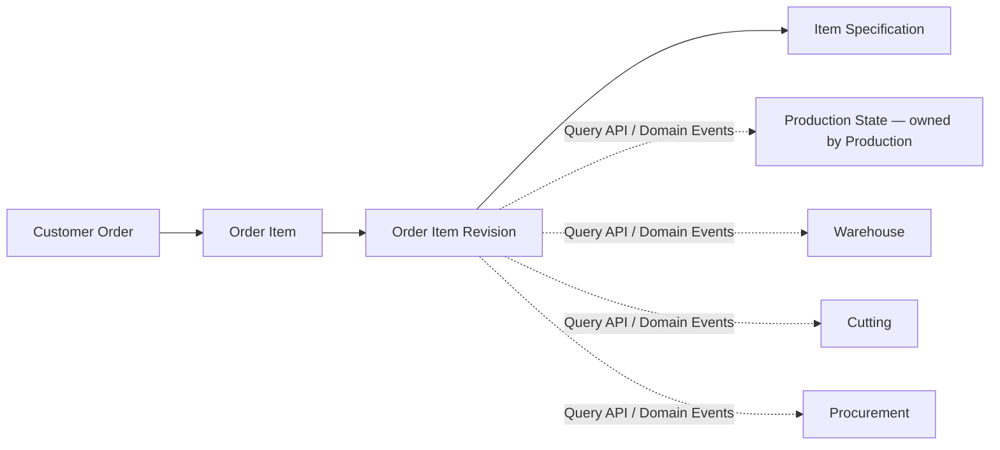

# Order Management Specification

**Document ID:** TMP-SPEC-010
**Status:** Accepted
**Version:** 1.1

---

# 1. Назначение

Order Management — функциональная область TOP Manufacturing Platform (TMP), отвечающая за коммерческий жизненный цикл заказов клиентов, позиций заказов, редакций позиций и спецификаций изделий.

Order Management является единственным владельцем заказов клиентов, позиций заказов, редакций позиций и их спецификаций.

Главным объектом платформы является **позиция заказа (Order Item)**.

Именно позиция заказа (в конкретной утверждённой Revision) является источником данных для Production, Warehouse, Cutting, Procurement и других Capability.

Order Management **не владеет** производственным состоянием. Производственное состояние принадлежит Production и связывается им с `Order Item ID` и `Order Item Revision`.

---

# 2. Цели Order Management

Order Management обеспечивает:

* единое хранение заказов клиентов;
* управление коммерческим жизненным циклом заказа;
* управление коммерческим жизненным циклом позиции заказа;
* управление жизненным циклом редакции позиции (Order Item Revision);
* хранение коммерческой информации;
* формирование неизменяемой спецификации изделия, привязанной к конкретной Revision;
* предоставление данных другим Capability через Query Public API и Domain Events;
* управление изменениями заказа исключительно через бизнес-документы;
* прослеживаемость собственных изменений;
* полную совместимость с документной моделью TMP.

Order Management **не** хранит и **не** вычисляет производственное состояние.

---

# 3. Область ответственности

Order Management является единственным владельцем и хранителем:

* Customer Order;
* Order Item;
* Order Item Revision;
* Item Specification;
* коммерческих данных заказа;
* количества изделий в конкретной Revision;
* связей между позициями и их редакциями;
* признака актуальной (current) Revision;
* коммерческого жизненного цикла заказа и позиции;
* жизненного цикла редакции позиции;
* истории собственных изменений.

Order Management отвечает за:

* заказы клиентов;
* позиции заказов;
* редакции позиций;
* спецификации редакций;
* коммерческие параметры;
* количество изделий в редакции;
* ссылки на связанные документы Order Management;
* связи между редакциями позиций;
* предоставление собственных данных другим Capability;
* бизнес-правила изменения заказов и позиций.

---

# 4. Что не входит в Order Management

Order Management не владеет и не хранит:

* производственное состояние (Production State);
* `Production Status` (`NOT_STARTED`, `READY_FOR_PRODUCTION`, `IN_PRODUCTION`, `PARTIALLY_RELEASED`, `RELEASED`, `CANCELLED` производственного состояния);
* запущенное количество (launched quantity);
* активное производственное количество (active production quantity);
* выпущенное количество (released quantity);
* производственные партии;
* документы запуска, отмены запуска и выпуска;
* историю изменения производственного состояния;
* складские остатки;
* резервирование материалов;
* складские операции и движения;
* партии материалов;
* закупку материалов и поставщиков;
* карты раскроя (Cutting Plan) и их внутренние данные;
* производственную аналитику;
* контроль качества;
* транспортировку;
* финансовый учёт;
* расчёт заработной платы.

Order Management также **не изменяет**:

* производственные статусы;
* складские состояния;
* складские документы;
* партии материалов;
* движения материалов.

Эти данные принадлежат соответствующим Capability и доступны только через их Public API и Domain Events.

> **Architecture Rule (ADR-019)**
> Каждая Capability владеет только собственными бизнес-данными. Order Management не хранит копии данных Production, Warehouse или Cutting Optimization.

---

# 5. Основные архитектурные принципы

1. Главным производственным объектом платформы является **позиция заказа** (ADR-017).
2. Заказ клиента является контейнером коммерческой информации.
3. Production, Warehouse и Cutting работают исключительно с конкретной утверждённой Revision позиции заказа.
4. Спецификация Revision является единственным источником данных о составе изделия.
5. После утверждения Revision её спецификация становится неизменяемой (ADR-018).
6. Изменение изделия выполняется созданием новой Revision позиции либо новой позиции.
7. Проведённые документы не изменяются (ADR-021).
8. Вычисляемые состояния не хранятся (ADR-020).
9. Order Management не владеет производственным состоянием, складскими остатками и картами раскроя (ADR-019).
10. Любое изменение агрегатов Order Management выполняется только через бизнес-документ Document Engine (ADR-004).
11. Другие Capability взаимодействуют с Order Management только через Query Public API и Domain Events (ADR-003).
12. Владелец хранения данных совпадает с владельцем логики их изменения. Не допускается ситуация «одна Capability хранит, другая изменяет».

---

# 6. Общая модель



Главным объектом взаимодействия между Capability является **Order Item в конкретной Revision** (`Order Item ID` + `Order Item Revision`).

Производственное состояние (пунктирные связи) принадлежит Production и не хранится Order Management.

---

# 7. Границы Capability (сводно)

| Данные | Владелец (хранение и изменение) |
|---|---|
| Customer Order, коммерческие данные | Order Management |
| Order Item, признак активности позиции | Order Management |
| Order Item Revision, номер редакции, current-признак | Order Management |
| Item Specification (состав изделия, нормы) | Order Management |
| Количество изделий в Revision (ordered quantity) | Order Management |
| Production Status, launched/active/released quantity | **Production** |
| Производственные партии, документы Production | **Production** |
| Stock Position, резервы, складские движения | **Warehouse** |
| Cutting Plan, Source Bar, Cut Piece | **Cutting Optimization** |
| Аналитические проекции | **Analytics** |

Order Management хранит только столбцы левой группы. Данные правой группы доступны только через Public API/Domain Events их владельцев.

---

# 8. Агрегаты

Order Management определяет один агрегатный корень верхнего уровня для коммерческого заказа и один агрегатный корень для позиции заказа. Редакция позиции и спецификация являются сущностями/значимыми объектами внутри границы агрегата Order Item.

## 8.1 Customer Order (Aggregate Root)

* **Aggregate Root:** `CustomerOrder`.
* **Идентификатор:** `OrderId` (стабильный, неизменяемый).
* **Сущности / Value Objects:** `OrderNumber` (уникальный), `CustomerRef`, `ContractRef`, `SiteRef`, `Direction`, `Currency`, `OrderStatus`, служебные поля (created/updated, optimistic-lock version).
* **Инварианты:**
  * номер заказа уникален;
  * коммерческие поля изменяются только в статусе `DRAFT`;
  * заказ ссылается на свои позиции по `OrderItemId`, но не содержит их как вложенные сущности (Order Item — отдельный агрегат).
* **Допустимые изменения:** только через бизнес-документы Order Management (см. §12).
* **Граница транзакции:** `CustomerOrder` изменяется в собственной транзакции; изменение позиций выполняется в транзакции агрегата Order Item.
* **Связи:** содержит ссылки на `OrderItemId`; не хранит производственное состояние.

### Атрибуты Customer Order

| Атрибут | Назначение |
| --- | --- |
| ID (`OrderId`) | Уникальный идентификатор |
| Номер | Уникальный номер заказа |
| Заказчик | Клиент |
| Договор | Основание выполнения |
| Объект | Строительный объект |
| Дата | Дата оформления |
| Ответственный | Менеджер |
| Направление | Частное / дилер / корпоративный |
| Валюта | Валюта расчётов |
| Статус | Коммерческий статус заказа (см. §11) |

Customer Order **не** содержит атрибута производственного статуса и **не** содержит производственных количеств.

## 8.2 Order Item (Aggregate Root)

* **Aggregate Root:** `OrderItem` — главный объект платформы.
* **Идентификатор:** `OrderItemId` (стабильный, неизменяемый на протяжении всех редакций).
* **Сущности / Value Objects:** набор `OrderItemRevision` (см. §8.3), `currentRevisionNumber` (ссылка на актуальную утверждённую Revision), `OrderItemStatus` (коммерческий статус позиции), `ProductCode`, служебные поля.
* **Инварианты:**
  * позиция принадлежит ровно одному заказу;
  * в любой момент существует не более одной Revision в статусе `DRAFT`;
  * `currentRevisionNumber` указывает на последнюю утверждённую Revision (если она есть);
  * номера редакций монотонно возрастают и не переиспользуются;
  * позиция не хранит производственный статус и производственные количества.
* **Допустимые изменения:** только через бизнес-документы Order Management.
* **Граница транзакции:** агрегат Order Item включает свои Revision и их Specification; создание/обновление/утверждение Revision и заморозка Specification выполняются атомарно в границе Order Item.
* **Связи:** принадлежит `CustomerOrder`; предоставляет `Order Item ID` + `Order Item Revision` внешним Capability.

### Атрибуты Order Item

| Атрибут | Назначение |
| --- | --- |
| ID (`OrderItemId`) | Стабильный идентификатор позиции |
| Order | Родительский заказ (`OrderId`) |
| Код изделия | Код изделия |
| Наименование | Наименование |
| Current Revision | Номер актуальной утверждённой редакции |
| Статус | Коммерческий статус позиции (см. §12) |
| Активность | Признак активности позиции (не отменена) |

Order Item **не** содержит столбцов `Производственные статусы` и производственных количеств (перенесены во владение Production).

## 8.3 Order Item Revision (сущность в границе Order Item)

* **Идентификатор:** составной — `OrderItemId` + `RevisionNumber`.
* **Value Objects:** `RevisionNumber`, `RevisionStatus` (`DRAFT` | `APPROVED`), `OrderedQuantity`, ссылка на предыдущую Revision, ссылка на `ItemSpecification`.
* **Инварианты:**
  * `RevisionNumber` уникален в пределах позиции;
  * ровно одна `Item Specification` на Revision;
  * после `APPROVED` спецификация и утверждённые коммерческие параметры Revision неизменяемы;
  * предыдущие Revision не изменяются и не удаляются.
* **Граница транзакции:** входит в агрегат Order Item.

## 8.4 Item Specification (значимый объект в границе Revision)

* **Идентификатор:** привязан к конкретной Revision (`OrderItemId` + `RevisionNumber`).
* **Состав:** перечень материалов, количество каждого материала, единицы измерения, нормы расхода, производственные параметры, служебные характеристики.
* **Не содержит:** складских остатков, партий, складских состояний, производственных документов, информации о резервировании, производственных количеств.
* **Инвариант:** после утверждения Revision содержимое спецификации неизменяемо (ADR-018).

---

# 9. Revision model

Модель редакций формализована однозначно:

1. **Стабильность `Order Item ID`.** Идентификатор позиции не меняется при создании новых редакций. Внешние Capability всегда ссылаются на позицию через `Order Item ID`.
2. **Номер Revision.** Каждая редакция имеет `RevisionNumber` (целочисленный, монотонно возрастающий, начиная с 1). Идентификация конкретной редакции — пара `Order Item ID + Revision`.
3. **Актуальная (current) Revision.** Order Item хранит `currentRevisionNumber`, указывающий на последнюю утверждённую редакцию. «Актуальность» конкретной Revision вычисляется сравнением с `currentRevisionNumber` и не дублируется в каждой редакции.
4. **Создание новой Revision.** Разрешено только для позиции, у которой текущая редакция уже `APPROVED`. Новая редакция создаётся в статусе `DRAFT` с собственной редактируемой спецификацией; предыдущая редакция и её спецификация не изменяются.
5. **Утверждение Revision.** Перевод редакции из `DRAFT` в `APPROVED` выполняется соответствующим бизнес-документом. В момент утверждения спецификация редакции становится Immutable, а `currentRevisionNumber` позиции переключается на эту редакцию.
6. **Неизменяемость утверждённой Revision.** Содержимое спецификации и утверждённые параметры не изменяются никогда. Переключение `currentRevisionNumber` на более новую редакцию не изменяет содержимое предыдущих редакций.
7. **Поведение предыдущей Revision.** Предыдущие редакции сохраняются как история; их спецификации остаются доступны для чтения по `Order Item ID + Revision`.
8. **Доступ будущих Capability к конкретной Revision.** Production, Warehouse, Cutting и Procurement получают данные строго по паре `Order Item ID + Revision` через Query Public API и связывают своё состояние именно с этой парой.

> **Architecture Rule (ADR-018)**
> Изменение изделия создаёт новую Revision, а не изменяет существующую.

---

# 10. Неизменяемость спецификации

После утверждения Revision её Item Specification становится **Immutable**:

* нельзя изменить материал;
* нельзя изменить количество материала;
* нельзя удалить материал;
* нельзя добавить материал;
* нельзя изменить нормы расхода;
* нельзя заменить материал другим.

Изменение изделия после утверждения допускается только через:

* создание новой Revision позиции;
* создание новой позиции;
* отмену позиции по разрешённому бизнес-процессу.

Прямое изменение существующей утверждённой спецификации запрещено. Предыдущие Revision и их спецификации не изменяются и не удаляются.

> **Architecture Rule (ADR-018)**
> Спецификация утверждённой Revision — единственный и неизменяемый источник данных о составе изделия.

---

# 11. Коммерческий жизненный цикл Customer Order

Заказ клиента отражает **только коммерческий** жизненный цикл. Производственное состояние заказа Order Management не хранит и не вычисляет в рамках Stage 5.

## 11.1 Статусы заказа (хранимые в Stage 5)

| Статус | Назначение |
| --- | --- |
| `DRAFT` | Черновик заказа |
| `APPROVED` | Заказ утверждён |
| `CANCELLED` | Заказ отменён |

### Отложенные статусы

Статусы `IN_PROGRESS` и `COMPLETED` из версии 1.0 **исключены из хранимой модели Stage 5**, так как для них отсутствует самостоятельный коммерческий процесс, инициирующий документ и transition matrix. Эти состояния являются производными от производственного состояния позиций, владельцем которого является Production.

Определение и возможная материализация этих состояний переносятся в **будущую интеграционную задачу Order Management ↔ Production** (вне Stage 5). Order Management не выполняет автоматический переход заказа в `IN_PROGRESS`/`COMPLETED` на основании `Production Status`.

## 11.2 Transition matrix — Customer Order

| From | To | Business document | Required capability | Preconditions | Forbidden conditions | Domain event |
| --- | --- | --- | --- | --- | --- | --- |
| (none) | `DRAFT` | `ORDER_CREATE` | `order.order.create` | уникальный номер заказа | дублирующий номер | `OrderCreated` |
| `DRAFT` | `DRAFT` | `ORDER_UPDATE` | `order.order.edit` | заказ в `DRAFT` | изменение утверждённого/отменённого заказа | `OrderUpdated` |
| `DRAFT` | `APPROVED` | `ORDER_APPROVE` | `order.order.approve` | заказ содержит ≥ 1 активную позицию | утверждение заказа без активных позиций | `OrderApproved` |
| `DRAFT` | `CANCELLED` | `ORDER_CANCEL` | `order.order.cancel` | заказ в `DRAFT` | повторная отмена | `OrderCancelled` |
| `APPROVED` | `CANCELLED` | `ORDER_CANCEL` | `order.order.cancel` | заказ в `APPROVED` | повторная отмена | `OrderCancelled` |

Order Management не изменяет статус заказа на основании складских или производственных операций.

---

# 12. Коммерческий жизненный цикл Order Item

Позиция имеет собственный **коммерческий** жизненный цикл, отделённый от производственного жизненного цикла (Production lifecycle), которым владеет Production.

## 12.1 Статусы позиции (хранимые в Stage 5)

| Статус | Назначение |
| --- | --- |
| `DRAFT` | Позиция формируется; активная редакция в `DRAFT` |
| `ACTIVE` | Позиция имеет ≥ 1 утверждённую редакцию; доступна другим Capability |
| `CANCELLED` | Позиция отменена |

Статусы `NOT_STARTED`, `READY_FOR_PRODUCTION`, `IN_PRODUCTION`, `PARTIALLY_RELEASED`, `RELEASED` **не являются** статусами Order Item. Это `Production Status`, принадлежащий Production и связываемый им с `Order Item ID + Revision`. Order Management может упоминать их только как внешнее состояние, читаемое через Production Public API.

## 12.2 Transition matrix — Order Item

| From | To | Business document | Required capability | Preconditions | Forbidden conditions | Domain event |
| --- | --- | --- | --- | --- | --- | --- |
| (none) | `DRAFT` | `ORDER_ITEM_CREATE` | `order.item.create` | родительский заказ в `DRAFT`/`APPROVED` | добавление позиции в отменённый заказ | `OrderItemCreated`, `OrderItemRevisionCreated` |
| `DRAFT` | `DRAFT` | `ORDER_ITEM_UPDATE` | `order.item.edit` | позиция в `DRAFT`; редакция в `DRAFT` | изменение после утверждения редакции | `OrderItemUpdated` |
| `DRAFT` | `ACTIVE` | `ORDER_ITEM_REVISION_APPROVE` | `order.item.approve` | текущая редакция в `DRAFT`, спецификация валидна | утверждение без спецификации | `OrderItemRevisionApproved` |
| `ACTIVE` | `ACTIVE` | `ORDER_ITEM_REVISION_CREATE` → `ORDER_ITEM_REVISION_APPROVE` | `order.revision.create`, `order.item.approve` | текущая редакция `APPROVED` | новая редакция при существующей `DRAFT` | `OrderItemRevisionCreated`, затем `OrderItemRevisionApproved` |
| `DRAFT` | `CANCELLED` | `ORDER_ITEM_CANCEL` | `order.item.cancel` | позиция в `DRAFT` | повторная отмена | `OrderItemCancelled` |
| `ACTIVE` | `CANCELLED` | `ORDER_ITEM_CANCEL` | `order.item.cancel` | позиция в `ACTIVE` | повторная отмена | `OrderItemCancelled` |

## 12.3 Transition matrix — Order Item Revision

| From | To | Business document | Required capability | Preconditions | Forbidden conditions | Domain event |
| --- | --- | --- | --- | --- | --- | --- |
| (none) | `DRAFT` | `ORDER_ITEM_CREATE` (Revision 1) или `ORDER_ITEM_REVISION_CREATE` (Revision N+1) | `order.item.create` / `order.revision.create` | для N+1: предыдущая редакция `APPROVED` | вторая `DRAFT`-редакция у позиции | `OrderItemRevisionCreated` |
| `DRAFT` | `APPROVED` | `ORDER_ITEM_REVISION_APPROVE` | `order.item.approve` | спецификация редакции заполнена и валидна | утверждение пустой/невалидной спецификации | `OrderItemRevisionApproved` |

После `APPROVED` спецификация редакции неизменяема; отдельного статуса «superseded» не хранится — актуальность вычисляется по `currentRevisionNumber` позиции.

## 12.4 Разделение жизненных циклов

Явно разделены четыре жизненных цикла:

```text
Customer Order commercial lifecycle   → §11 (Order Management)
Order Item commercial lifecycle       → §12.2 (Order Management)
Order Item Revision lifecycle         → §12.3 (Order Management)
Production lifecycle                   → Production Specification (Production)
```

Production lifecycle **не входит** в реализацию Stage 5 и не является жизненным циклом Order Item.

---

# 13. Производственное состояние (внешнее)

Производственное состояние Revision позиции заказа принадлежит **Production** и связывается им с `Order Item ID` + `Order Item Revision` (Production Specification §4, §5).

Order Management:

* **не** хранит `Production Status`;
* **не** хранит launched/active/released quantity;
* **не** хранит производственные партии;
* **не** предоставляет операций изменения производственного состояния;
* получает производственное состояние (при необходимости в UI) только через Production Public API (`getProductionState(orderItemId, revision)`).

> **Architecture Rule (ADR-019)**
> Производственное состояние изменяет и хранит только Production. Никакая другая Capability не хранит его копию.

Завершённость производства заказа является вычисляемым состоянием (ADR-020) и в Stage 5 не хранится и не вычисляется Order Management.

---

# 14. Изменение заказа и позиции

Любое изменение выполняется только через бизнес-документ (ADR-004).

* До утверждения заказа (`DRAFT`) разрешено изменять коммерческие данные и список позиций документом `ORDER_UPDATE`.
* После утверждения заказа изменения ограничены бизнес-правилами предприятия.
* До утверждения редакции позиции (`DRAFT`) разрешено изменять изделие, количество, характеристики и спецификацию документом `ORDER_ITEM_UPDATE`.
* После утверждения редакции изменение спецификации, материалов и норм расхода запрещено. Изменение изделия выполняется новой редакцией (`ORDER_ITEM_REVISION_CREATE`).

Производственные и складские Capability не изменяют заказ, позицию, редакцию или спецификацию напрямую.

---

# 15. Public API

Public API Order Management строго разделён на **Query API** (для других Capability) и **внутренний Application API** (только для собственных Document Processors).

## 15.1 Query API (доступен другим Capability)

```text
getOrder(orderId)
getOrderItem(orderItemId)
getOrderItemRevision(orderItemId, revision)
getCurrentOrderItemRevision(orderItemId)
getItemSpecification(orderItemId, revision)
```

* Возвращают только данные, владельцем которых является Order Management.
* DTO **не содержат** `Production Status`, производственных количеств, складских или раскроечных данных.
* Только чтение; не изменяют состояние.

## 15.2 Внутренний Application API (только Document Processors Order Management)

```text
createOrder(...)
updateOrder(...)
approveOrder(...)
cancelOrder(...)
createOrderItem(...)
updateOrderItem(...)
approveOrderItemRevision(...)
cancelOrderItem(...)
createOrderItemRevision(...)
```

Эти операции:

* **не** предоставляются другим Capability для прямого вызова;
* **не** заменяют бизнес-документы;
* выполняются исключительно в процессе проведения соответствующего документа Order Management;
* вызываются только Document Processor'ами Order Management.

> **Architecture Rule (ADR-003, ADR-004)**
> Изменяющие операции Order Management не являются внешним Public API. Внешнее прямое изменение агрегатов запрещено.

## 15.3 Public API не предоставляет

Order Management не предоставляет операций запуска производства, проверки готовности, выпуска изделий, формирования карты раскроя, создания складских документов, резервирования, списания материалов, изменения производственных статусов или складских остатков. Эти операции принадлежат другим Capability.

---

# 16. Документная модель

Любое бизнес-изменение начинается с бизнес-документа Document Engine:

```text
User action
  -> создание документа через Document Engine
  -> проверка документа
  -> проведение документа
  -> Order Management Document Processor
  -> application command
  -> domain aggregate
  -> persistence
  -> Domain Event
```

Пользовательский интерфейс и внешние клиенты не вызывают напрямую методы, изменяющие агрегаты.

## 16.1 Каталог бизнес-документов Stage 5

Для каждой изменяющей операции определён ровно один бизнес-документ.

| Document type code | Business name | Payload (ключевое) | Document Processor | Application command | Affected aggregate | Required capability | Validation rules | Result | Domain event | Idempotency rule |
| --- | --- | --- | --- | --- | --- | --- | --- | --- | --- | --- |
| `ORDER_CREATE` | Создание заказа | номер, заказчик, договор, объект, дата, направление, валюта | `OrderCreateProcessor` | `createOrder` | Customer Order | `order.order.create` | номер уникален; обязательные поля заполнены | заказ в `DRAFT` | `OrderCreated` | по `documentId`: повторное проведение не создаёт второй заказ |
| `ORDER_UPDATE` | Изменение заказа | orderId, изменяемые коммерческие поля | `OrderUpdateProcessor` | `updateOrder` | Customer Order | `order.order.edit` | заказ в `DRAFT` | обновлённые коммерческие данные | `OrderUpdated` | по `documentId` |
| `ORDER_APPROVE` | Утверждение заказа | orderId | `OrderApproveProcessor` | `approveOrder` | Customer Order | `order.order.approve` | заказ в `DRAFT`; ≥ 1 активная позиция | заказ в `APPROVED` | `OrderApproved` | по `documentId`; повторное проведение — no-op при `APPROVED` |
| `ORDER_CANCEL` | Отмена заказа | orderId, причина | `OrderCancelProcessor` | `cancelOrder` | Customer Order | `order.order.cancel` | заказ в `DRAFT`/`APPROVED` | заказ в `CANCELLED` | `OrderCancelled` | по `documentId`; no-op при `CANCELLED` |
| `ORDER_ITEM_CREATE` | Создание позиции | orderId, код изделия, наименование, количество, спецификация (черновик) | `OrderItemCreateProcessor` | `createOrderItem` | Order Item | `order.item.create` | заказ в `DRAFT`/`APPROVED` | позиция в `DRAFT` + Revision 1 `DRAFT` | `OrderItemCreated`, `OrderItemRevisionCreated` | по `documentId` |
| `ORDER_ITEM_UPDATE` | Изменение позиции | orderItemId, изменяемые поля/спецификация | `OrderItemUpdateProcessor` | `updateOrderItem` | Order Item | `order.item.edit` | позиция `DRAFT`; редакция `DRAFT` | обновлённая черновая редакция | `OrderItemUpdated` | по `documentId` |
| `ORDER_ITEM_REVISION_APPROVE` | Утверждение редакции позиции | orderItemId, revisionNumber | `OrderItemRevisionApproveProcessor` | `approveOrderItemRevision` | Order Item | `order.item.approve` | редакция `DRAFT`; спецификация валидна | редакция `APPROVED`; спецификация Immutable; позиция `ACTIVE`; `currentRevision` обновлён | `OrderItemRevisionApproved` | по `documentId`; no-op при уже `APPROVED` |
| `ORDER_ITEM_CANCEL` | Отмена позиции | orderItemId, причина | `OrderItemCancelProcessor` | `cancelOrderItem` | Order Item | `order.item.cancel` | позиция `DRAFT`/`ACTIVE` | позиция `CANCELLED` | `OrderItemCancelled` | по `documentId`; no-op при `CANCELLED` |
| `ORDER_ITEM_REVISION_CREATE` | Создание новой редакции позиции | orderItemId, спецификация (черновик), количество | `OrderItemRevisionCreateProcessor` | `createOrderItemRevision` | Order Item | `order.revision.create` | текущая редакция `APPROVED`; нет открытой `DRAFT`-редакции | новая Revision `DRAFT` | `OrderItemRevisionCreated` | по `documentId` |

Документы, не имеющие конкретного бизнес-смысла, не добавляются. Каждая изменяющая операция §15.2 покрыта ровно одним документом.

---

# 17. Domain Events

Order Management публикует событие только после успешной фиксации транзакции (ADR-021). При откате транзакции событие не публикуется.

| Event type | Source operation | Moment of publication | Minimal payload | Consumers | Idempotency identifier |
| --- | --- | --- | --- | --- | --- |
| `OrderCreated` | `createOrder` (`ORDER_CREATE`) | после commit | eventId, occurredAt, orderId, actor, correlationId | внутренние подписчики | `orderId` + eventId |
| `OrderUpdated` | `updateOrder` (`ORDER_UPDATE`) | после commit | eventId, orderId, actor, correlationId | внутренние подписчики | `orderId` + eventId |
| `OrderApproved` | `approveOrder` (`ORDER_APPROVE`) | после commit | eventId, orderId, actor, correlationId | внутренние подписчики | `orderId` + eventId |
| `OrderCancelled` | `cancelOrder` (`ORDER_CANCEL`) | после commit | eventId, orderId, actor, correlationId | внутренние подписчики | `orderId` + eventId |
| `OrderItemCreated` | `createOrderItem` | после commit | eventId, orderId, orderItemId, actor, correlationId | внутренние подписчики | `orderItemId` + eventId |
| `OrderItemUpdated` | `updateOrderItem` | после commit | eventId, orderItemId, revision, actor | внутренние подписчики | `orderItemId` + revision + eventId |
| `OrderItemRevisionCreated` | `createOrderItem` (Rev 1) / `createOrderItemRevision` (Rev N+1) | после commit | eventId, orderItemId, revision, actor | внутренние подписчики | `orderItemId` + revision + eventId |
| `OrderItemRevisionApproved` | `approveOrderItemRevision` | после commit | eventId, orderId, orderItemId, revision, actor, correlationId | **Production** (Production Spec §16), Warehouse, Cutting | `orderItemId` + revision + eventId |
| `OrderItemCancelled` | `cancelOrderItem` | после commit | eventId, orderId, orderItemId, actor | внутренние подписчики | `orderItemId` + eventId |

### Обоснование отсутствия отдельных событий спецификации

Отдельные события `ItemSpecificationCreated` / `ItemSpecificationApproved` из версии 1.0 **не публикуются**: спецификация создаётся вместе со своей Revision и замораживается в момент утверждения редакции. Эти моменты полностью представлены событиями `OrderItemRevisionCreated` и `OrderItemRevisionApproved`. Дублирующие события не вводятся.

Order Management **не** публикует события Production, Warehouse или Cutting от своего имени.

---

# 18. Security

Order Management не управляет пользователями. Проверку разрешений выполняет Security. Order Management определяет только требуемую capability для каждого действия.

Коды capability используют формат Security `PermissionId` — три сегмента `<area>.<resource>.<action>` в нижнем регистре (совместимо с текущей реализацией `tmp-security`).

## 18.1 Каталог capability Order Management

| Capability code | Действие |
| --- | --- |
| `order.order.view` | Просмотр заказов |
| `order.order.create` | Создание заказа |
| `order.order.edit` | Изменение заказа |
| `order.order.approve` | Утверждение заказа |
| `order.order.cancel` | Отмена заказа |
| `order.item.view` | Просмотр позиций и редакций |
| `order.item.create` | Создание позиции |
| `order.item.edit` | Изменение позиции |
| `order.item.approve` | Утверждение редакции позиции |
| `order.item.cancel` | Отмена позиции |
| `order.revision.create` | Создание новой редакции позиции |
| `order.specification.view` | Просмотр спецификации |

### Reconciliation с v1.0

Коды v1.0 `order.read` (2 сегмента) и `order.item.revision.create` (4 сегмента) не соответствуют формату `PermissionId` реализованной Security (ровно 3 сегмента) и заменены на `order.order.view` и `order.revision.create` соответственно; `order.specification.read` приведён к `order.specification.view`. Добавлен `order.item.view` для Query API.

---

# 19. Persistence scope

Order Management (Stage 5) хранит в собственной схеме `order_management`:

* заказы (`orders`);
* позиции заказов (`order_items`), включая `current_revision_number`, коммерческий статус, признак активности;
* редакции позиций (`order_item_revisions`): `order_item_id`, `revision_number`, `revision_status`, `ordered_quantity`, ссылку на предыдущую редакцию;
* спецификации (`item_specifications`) и их строки (`item_specification_lines`), привязанные к `order_item_id` + `revision_number`.

Трассируемость собственных изменений обеспечивается проведёнными бизнес-документами Document Engine и опубликованными Domain Events; отдельный дублирующий журнал не вводится без выявленного пробела.

## 19.1 Явно запрещено хранить

Stage 5 не создаёт таблиц, полей, enum или событий для:

* `Production Status`;
* launched quantity;
* active production quantity;
* released quantity;
* производственных партий и производственных документов;
* Warehouse Stock Position, резервов, складских движений;
* Cutting Plan internals.

Владельцем этих данных являются соответствующие Capability.

---

# 20. Интеграция с будущими Capability

Order Management предоставляет стабильные идентификаторы (`Order Item ID`, `Order Item Revision`), Query DTO и Domain Events. Будущие Capability интегрируются только через них и не имеют права изменять данные Order Management.

## 20.1 Production

* **Query от Order Management:** `getOrderItemRevision`, `getCurrentOrderItemRevision`, `getItemSpecification` (состав, количество, сведения о редакции).
* **Domain Events от Order Management:** `OrderItemRevisionApproved` (запускает работу Production с редакцией).
* **Идентификаторы:** `Order Item ID` + `Order Item Revision`.
* **Запрещено:** Production не изменяет заказ, позицию, редакцию, спецификацию. Production владеет производственным состоянием и связывает его с `Order Item ID + Revision` в собственном хранилище.

## 20.2 Warehouse

* **Query:** спецификация и количество редакции по `Order Item ID + Revision`.
* **Запрещено:** Warehouse не изменяет позицию, заказ, спецификацию, количество.

## 20.3 Cutting Optimization

* **Query:** спецификация, размеры, количество, `Order Item ID + Revision`.
* **Запрещено:** Cutting не изменяет спецификацию; Cutting Plan и его внутренние данные — вне Order Management.

## 20.4 Procurement / Analytics

* Используют исходные данные и read-only ссылки Order Management; решения и проекции принадлежат им.

---

# 21. Инварианты

1. Заказ, позиция, редакция и спецификация принадлежат Order Management.
2. Главный производственный объект — позиция заказа в конкретной Revision.
3. Спецификация утверждённой Revision — единственный источник состава изделия.
4. После утверждения Revision спецификация Immutable.
5. Order Management не хранит производственный статус и производственные количества.
6. Производственное состояние изменяет и хранит только Production (по `Order Item ID + Revision`).
7. Владелец хранения данных совпадает с владельцем их изменения.
8. Все изменения агрегатов выполняются только через бизнес-документы.
9. Изменяющие операции не являются внешним Public API.
10. Другие Capability используют только Query API и Domain Events Order Management.
11. `Order Item ID` стабилен; конкретная редакция идентифицируется парой `Order Item ID + Revision`.
12. Предыдущие Revision и их спецификации не изменяются и не удаляются.
13. Изменение изделия создаёт новую Revision.
14. Проведённые документы не изменяются.
15. Вычисляемые состояния не хранятся.
16. Order Management не хранит копий данных Production, Warehouse и Cutting.
17. Событие публикуется только после успешного commit.

---

# 22. Ограничения версии 1.1

В версию 1.1 не входят:

* изменение утверждённой спецификации;
* совместное редактирование позиции;
* автоматическое слияние редакций;
* управление вариантами исполнения и конфигурациями изделия;
* альтернативные спецификации;
* коммерческие статусы заказа `IN_PROGRESS`/`COMPLETED` (перенесены в будущую интеграцию с Production);
* встроенная аналитика заказов;
* финансовое планирование, управление договорами и оплатами.

---

# 23. Architecture Rules

### AR-001
Главным объектом платформы является позиция заказа (ADR-017).

### AR-002
Заказ является контейнером коммерческой информации.

### AR-003
Спецификация позиции принадлежит Order Management и привязана к конкретной Revision.

### AR-004
После утверждения Revision спецификация становится Immutable (ADR-018).

### AR-005
Все Capability используют одну и ту же неизменяемую спецификацию конкретной Revision.

### AR-006
Производственное состояние (`Production Status` и количества) хранит и изменяет только Production (ADR-019).

### AR-007
Warehouse и Cutting не изменяют спецификацию.

### AR-008
Завершённость производства заказа вычисляется владельцем производственного состояния, а не хранится Order Management (ADR-020).

### AR-009
Изменение изделия выполняется новой Revision (ADR-018).

### AR-010
История и проведённые документы никогда не изменяются (ADR-021).

### AR-011
Любое изменение агрегата инициируется бизнес-документом (ADR-004).

### AR-012
Изменяющие операции недоступны как внешний Public API; межмодульное взаимодействие — только через Query API и Domain Events (ADR-003).

---

# 24. Связанные документы

* TMP Constitution
* TMP Architecture Decisions (ADR-003, ADR-004, ADR-017, ADR-018, ADR-019, ADR-020, ADR-021, ADR-022)
* Platform Core Specification
* Capability Engine Specification
* Security Specification
* Document Engine Specification
* Production Specification (v1.1)
* Warehouse Specification
* Cutting Optimization Specification
* Procurement Specification

---

# 25. История документа

| Версия | Изменение |
| ------ | --------- |
| 1.0 | Полностью переработана архитектура Order Management. Закреплена позиция заказа как главный объект платформы, введена неизменяемая спецификация (Immutable Specification), определены правила взаимодействия с Production, Warehouse и Cutting, добавлены Public API, Domain Events, Capability, архитектурные инварианты и правила создания новых редакций позиций. |
| 1.1 | Разделено владение Order Management и Production; удалено хранение производственных статусов и производственных количеств из Order Management; явно разделены коммерческий и производственный жизненные циклы (Customer Order, Order Item, Order Item Revision, Production); уточнена модель Revision (стабильный `Order Item ID`, `current` Revision, неизменяемость утверждённой Revision); изменяющие операции привязаны к Document Engine и выведены из внешнего Public API; введён каталог бизнес-документов; Public API разделён на Query API и внутренний Application API; добавлены transition matrices для всех хранимых статусов; уточнены Domain Events (добавлены `OrderUpdated`, `OrderItemUpdated`; `OrderItemRevisionApproved` как источник для Production; убраны дублирующие события спецификации); коды capability приведены к 3-сегментному формату Security `PermissionId`; статусы `IN_PROGRESS`/`COMPLETED` заказа перенесены в будущую интеграцию с Production; определён persistence scope с явным запретом хранения производственных, складских и раскроечных данных. |
