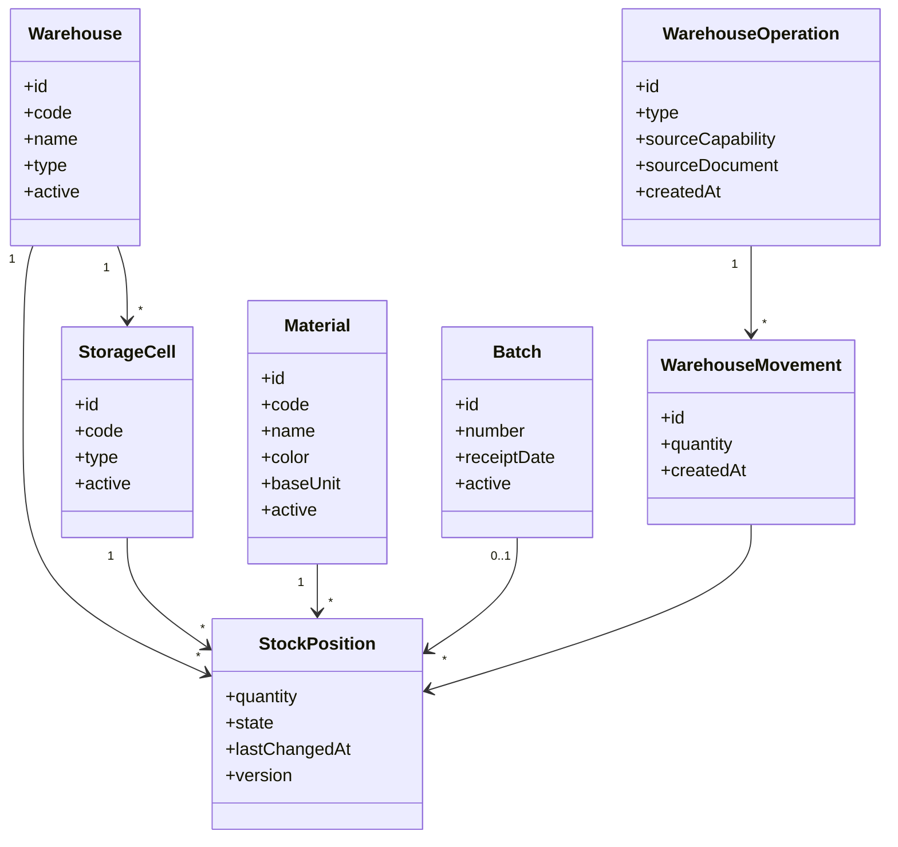

# Warehouse Specification

**Document ID:** TMP-SPEC-011  
**Status:** Accepted  
**Version:** 1.1

---

# 1. Назначение

Warehouse — функциональная область TOP Manufacturing Platform (TMP), отвечающая за учёт, хранение, перемещение, резервирование и изменение состояния материалов.

Warehouse является единственным владельцем складских остатков платформы.

Любое изменение количества, места хранения или состояния материала выполняется исключительно Warehouse через Public API и внутренний механизм `Warehouse Operation`.

Warehouse не определяет производственную, закупочную или коммерческую причину складской операции.

Бизнес-смысл операции определяется документом-основанием и Capability, инициировавшей операцию.

Warehouse не рассчитывает производственную потребность.

Warehouse использует уже сформированную потребность, полученную:

- из Specification;
- из утверждённого Cutting Plan;
- либо из другого разрешённого источника.

> **Architecture Rule**  
> Ни одна другая Capability не создаёт Warehouse Movement и не изменяет Stock Position напрямую.

---

# 2. Цели Warehouse

Warehouse обеспечивает:

- единый достоверный учёт складских остатков;
- централизованное управление изменениями запасов;
- полную прослеживаемость складских операций;
- запрет отрицательных остатков;
- разделение текущего состояния и истории склада;
- поддержку основного склада и склада производства;
- перемещение материалов между складами и ячейками;
- резервирование материалов;
- учёт материалов в пути;
- поддержку партийного учёта;
- безопасное взаимодействие с Production и другими Capability;
- возможность исправления ошибок только компенсирующими документами и операциями.

---

# 3. Область ответственности

Warehouse отвечает за:

- склады;
- ячейки хранения;
- складские позиции;
- состояния складского запаса;
- складские операции;
- складские движения;
- поступление материалов;
- размещение материалов;
- внутренние перемещения;
- межскладские перемещения;
- передачу материалов на склад производства;
- резервирование и снятие резерва;
- блокировку и разблокировку запасов;
- материалы в пути;
- возвраты со склада производства;
- ручное списание;
- корректировки;
- инвентаризацию;
- учёт партий;
- выбор партии;
- проверку доступности материалов;
- проверку возможности выполнения складской операции;
- запрет отрицательных остатков;
- создание и выполнение документов Warehouse;
- предоставление фактических данных об остатках другим Capability.

Warehouse является единственным владельцем:

- `Warehouse`;
- `Storage Cell`;
- `Stock Position`;
- `Stock State`;
- `Batch` (в части складского учёта);
- `Warehouse Operation`;
- `Warehouse Movement`;
- складских документов;
- складского состояния резервов.

---

# 4. Что не входит в Warehouse

Warehouse не отвечает за:

- создание и изменение заказов клиентов;
- создание и изменение позиций заказов;
- формирование спецификаций изделий;
- изменение спецификаций;
- расчёт производственной потребности;
- определение состава изделия;
- формирование карт раскроя;
- оптимизацию раскроя;
- планирование производства;
- запуск заказа в производство;
- изменение производственных статусов;
- регистрацию выпуска изделий;
- принятие решений о закупке;
- управление поставщиками;
- коммерческие данные заказов;
- определение приоритетов заказов;
- определение бизнес-причины складской операции;
- производственную аналитику;
- склад готовой продукции в версии 1.0.

Warehouse не принимает решение о том:

- какие материалы необходимы производству;
- какие позиции заказа необходимо запустить;
- какое количество изделий выпущено;
- какие материалы должны быть закуплены;
- какой заказ имеет больший приоритет.

Эти решения принадлежат соответствующим Capability.

---

# 5. Основные архитектурные принципы

1. Warehouse является единственным владельцем складских остатков.
2. Все изменения запасов выполняются через Warehouse Operation.
3. Warehouse Movement является неизменяемой записью истории.
4. Stock Position отражает только текущее состояние запаса.
5. Отрицательные остатки запрещены.
6. Каждая складская операция выполняется полностью либо не выполняется.
7. Прямое изменение Stock Position запрещено.
8. Проведённые складские документы не изменяются.
9. Ошибки исправляются новыми документами или компенсирующими операциями.
10. Warehouse не интерпретирует бизнес-смысл документа-основания.
11. Другие Capability взаимодействуют с Warehouse только через Public API.
12. Warehouse никогда не рассчитывает производственную потребность самостоятельно.
13. Источник производственной потребности определяет Production.
14. Для длинномерных материалов приоритет имеет утверждённый Cutting Plan.
15. При отсутствии Cutting Plan потребность определяется Specification.
16. Warehouse не использует внутренние объекты Cutting Optimization (`Source Bar`, `Cut Piece`, `Batch Allocation`).
17. Warehouse отвечает только за фактическое наличие, выбор партий, выбор складских позиций и выполнение складских операций.
18. Warehouse не изменяет производственные статусы позиций заказа.
19. Резервирование является изменением состояния складского запаса.
20. Материалы в состоянии `RESERVED` остаются физически на соответствующем складе и в соответствующей ячейке.
21. Передача материалов на склад производства является двухэтапной операцией.
22. Списание материалов при выпуске изделий выполняется только со склада производства.
23. Склад готовой продукции не входит в версию 1.0.

---

# 6. Общая модель Warehouse


Общая последовательность:

1. Бизнес-документ определяет смысл операции.
2. Document Processor соответствующей Capability формирует запрос к Warehouse.
3. Warehouse преобразует запрос во внутреннюю Warehouse Operation либо принимает уже сформированное описание операции через публичный контракт.
4. Warehouse выполняет проверки.
5. Warehouse блокирует затрагиваемые Stock Position.
6. Warehouse создаёт Warehouse Movement.
7. Warehouse обновляет Stock Position.
8. Warehouse публикует результат операции.
9. Бизнес-документ получает результат выполнения.

> **Architecture Rule**  
> Внешняя Capability может инициировать складскую операцию, но не управляет способом изменения складского состояния.

---

# 7. Основные объекты



---

# 8. Warehouse

Warehouse — самостоятельный бизнес-объект, представляющий склад предприятия.

## 8.1 Обязательные атрибуты

| Атрибут | Описание |
|----------|----------|
| ID | Уникальный идентификатор склада |
| Код | Уникальный неизменяемый код |
| Наименование | Отображаемое наименование |
| Тип | Тип склада |
| Активность | Возможность использования в новых операциях |
| Дата создания | Дата и время создания |
| Дата изменения | Дата и время последнего изменения |

---

## 8.2 Типы складов версии 1.0

В версии 1.0 поддерживаются:

- основной склад;
- склад производства;
- технический склад;
- временный склад.

### Основной склад

Основной склад используется для хранения материалов до передачи в производство или использования в других бизнес-процессах.

### Склад производства

Склад производства используется для хранения материалов, переданных непосредственно для производственного использования.

Списание материалов при выпуске изделий выполняется только со склада производства.

### Технический склад

Технический склад используется для вспомогательных материалов, инструмента и иных внутренних потребностей предприятия.

### Временный склад

Временный склад используется для временного размещения материалов.

> **Architecture Rule**  
> Склад готовой продукции отсутствует в версии 1.0.

> **Future Extension**  
> Склад готовой продукции может быть добавлен отдельным архитектурным решением.

---

## 8.3 Правила Warehouse

- код склада должен быть уникальным;
- склад не удаляется при наличии движений или остатков;
- неактивный склад нельзя использовать в новых операциях;
- деактивация склада не удаляет историю;
- все операции используют ссылку на Warehouse;
- строковое наименование склада никогда не используется как идентификатор;
- изменение типа склада допускается только после проверки ограничений.

---

# 9. Storage Cell

Storage Cell — самостоятельный бизнес-объект Warehouse, представляющий ячейку хранения.

Каждая Storage Cell принадлежит ровно одному Warehouse.

---

## 9.1 Обязательные атрибуты

| Атрибут | Описание |
|----------|----------|
| ID | Уникальный идентификатор |
| Код | Код ячейки |
| Warehouse | Склад-владелец |
| Тип | Тип ячейки |
| Активность | Возможность использования |
| Дата создания | Дата создания |
| Дата изменения | Дата изменения |

---

## 9.2 Типы ячеек

- `STANDARD`
- `RECEIVING`
- `PRODUCTION`
- `SHIPPING`
- `QUARANTINE`
- `SCRAP`
- `TEMPORARY`

### STANDARD

Основная ячейка хранения.

### RECEIVING

Ячейка временного размещения поступивших материалов.

### PRODUCTION

Ячейка хранения материалов склада производства.

### SHIPPING

Ячейка подготовки материалов к перемещению.

### QUARANTINE

Ячейка временно заблокированных материалов.

### SCRAP

Ячейка отходов и списанных материалов.

### TEMPORARY

Временная технологическая ячейка.

---

## 9.3 Правила Storage Cell

- код ячейки уникален в пределах склада;
- ячейка принадлежит только одному Warehouse;
- неактивная ячейка не используется в новых операциях;
- деактивация допускается только после проверки отсутствия остатков;
- любое перемещение выполняется через Warehouse Operation;
- изменение принадлежности существующей ячейки другому складу запрещено.

> **Future Extension**  
> В дальнейшем могут быть добавлены вместимость, координаты, максимальный вес, правила совместного хранения и другие параметры.

---

# 10. Material

Material — единый мастер-объект платформы.

Warehouse использует Material, но не является владельцем его мастер-данных.

Warehouse хранит только ссылку на Material и связанные с ним складские данные.

---

## 10.1 Используемые атрибуты Material

| Атрибут | Описание |
|----------|----------|
| ID | Уникальный идентификатор |
| Код | Код материала |
| Наименование | Наименование |
| Тип | Тип материала |
| Цвет | Цвет материала |
| Базовая единица | Единица складского учёта |
| Дополнительные единицы | Пользовательские единицы |
| Партийный учёт | Признак обязательного Batch |
| Стратегия партии | Правило выбора Batch |
| Активность | Возможность использования |

Материалы различных цветов являются различными объектами Material, если они не являются взаимозаменяемыми.

> **Architecture Rule**  
> Цвет является атрибутом Material, а не Stock Position.

---

## 10.2 Ограничения

Warehouse не может:

- создавать Material;
- изменять мастер-данные Material;
- изменять спецификации изделий;
- самостоятельно определять взаимозаменяемость материалов;
- использовать неактивный Material в новых операциях.

---

# 11. Единицы измерения

Каждый Material имеет:

- одну обязательную базовую единицу;
- ноль или более дополнительных единиц отображения.

Stock Position и Warehouse Movement всегда хранят количество только в базовой единице.

Пример:

| Материал | Базовая | Дополнительная | Коэффициент |
|----------|----------:|---------------:|------------:|
| Профиль | м | хлыст | 6.5 |
| Армирование | м | хлыст | 6 |
| Саморез | шт | упаковка | 500 |
| Уплотнитель | м | бухта | 200 |

Дополнительные единицы используются только:

- для пользовательского ввода;
- отображения;
- печатных форм;
- рекомендаций;
- пересчёта в базовую единицу.

---

## 11.1 Правила пересчёта

- коэффициент пересчёта должен быть положительным;
- итоговое количество хранится только в базовой единице;
- правила округления определяются Material;
- Warehouse не хранит параллельные остатки в нескольких единицах;
- изменение коэффициента не изменяет историю Warehouse Movement.

> **Architecture Rule**  
> Источником истины количества всегда является базовая единица Material.

---

# 12. Batch

Batch представляет конкретную складскую партию материала.

Batch используется только для складского учёта и прослеживаемости.

Warehouse является владельцем складской части Batch.

---

## 12.1 Обязательные атрибуты

| Атрибут | Описание |
|----------|----------|
| Batch ID | Уникальный идентификатор |
| Batch Number | Номер партии |
| Material | Материал |
| Receipt Date | Дата поступления |
| Supplier Batch | Номер партии поставщика (при наличии) |
| Expiration Date | Срок годности (при наличии) |
| Active | Признак активности |

---

## 12.2 Использование Batch

Batch используется:

- для партийного учёта;
- выбора партии при списании;
- прослеживаемости;
- инвентаризации;
- анализа истории движения материалов.

Batch не хранит остаток.

Остаток всегда определяется суммой соответствующих Stock Position.

---

## 12.3 Стратегии выбора партии

Material определяет стратегию выбора партии.

Поддерживаются:

- FIFO;
- FEFO;
- LIFO;
- Manual.

Warehouse использует стратегию только при автоматическом выборе партии.

Пользователь может изменить выбранную партию, если это разрешено бизнес-правилами.

---

# 13. Stock Position

Stock Position представляет текущее состояние конкретного материала.

Stock Position не является журналом операций.

Каждая запись отражает только актуальное состояние запаса.

---

## 13.1 Уникальность Stock Position

Одна Stock Position определяется комбинацией:

- Warehouse;
- Storage Cell;
- Material;
- Batch (если используется);
- Stock State.

Для одинаковой комбинации существует только одна Stock Position.

---

## 13.2 Обязательные атрибуты

| Атрибут | Описание |
|----------|----------|
| Warehouse | Склад |
| Storage Cell | Ячейка |
| Material | Материал |
| Batch | Партия |
| Stock State | Состояние |
| Quantity | Количество |
| Version | Версия записи |
| Last Changed At | Последнее изменение |

---

## 13.3 Правила Stock Position

Stock Position:

- не создаётся вручную;
- создаётся автоматически первой операцией;
- обновляется только Warehouse;
- не хранит историю изменений;
- не может иметь отрицательное количество;
- удаляется только при отсутствии остатка и отсутствии необходимости хранения.

История определяется Warehouse Movement.

---

# 14. Stock State

Stock State определяет доступность материала для различных бизнес-процессов.

Количество материала не изменяется при смене состояния.

Изменяется только возможность его использования.

---

## 14.1 Поддерживаемые состояния

| Код | Назначение |
|------|------------|
| AVAILABLE | Доступен |
| RESERVED | Зарезервирован |
| IN_TRANSIT | В пути |
| BLOCKED | Заблокирован |
| QUARANTINE | Карантин |
| SCRAPPED | Списан |

---

### AVAILABLE

Материал полностью доступен.

Допускается:

- резервирование;
- перемещение;
- списание;
- использование производством.

---

### RESERVED

Материал зарезервирован.

Физически материал остаётся:

- на том же складе;
- в той же ячейке;
- в той же партии.

Меняется только состояние.

---

### IN_TRANSIT

Материал находится между складами.

До завершения операции материал недоступен для использования.

---

### BLOCKED

Материал временно недоступен.

Причины блокировки Warehouse не интерпретирует.

---

### QUARANTINE

Материал помещён в карантин.

Использование запрещено.

---

### SCRAPPED

Материал списан.

Дальнейшее использование невозможно.

---

## 14.2 Допустимые переходы

```text
AVAILABLE
   │
   ├────────► RESERVED
   │
   ├────────► BLOCKED
   │
   ├────────► QUARANTINE
   │
   ├────────► IN_TRANSIT
   │
   └────────► SCRAPPED

RESERVED
   │
   └────────► AVAILABLE

BLOCKED
   │
   └────────► AVAILABLE

QUARANTINE
   │
   ├────────► AVAILABLE
   │
   └────────► SCRAPPED

IN_TRANSIT
   │
   └────────► AVAILABLE
```

Warehouse запрещает любые переходы, не входящие в данную схему.

---

# 15. Warehouse Operation

Warehouse Operation представляет атомарную складскую операцию.

Именно Warehouse Operation определяет:

- какие Stock Position изменяются;
- каким образом изменяются;
- какие Warehouse Movement будут созданы.

Warehouse Operation существует только внутри Warehouse.

Другие Capability не работают с данным объектом напрямую.

---

## 15.1 Типы операций

В версии 1.0 поддерживаются:

- Receipt;
- Put Away;
- Move;
- Reserve;
- Unreserve;
- Transfer;
- Receive Transfer;
- Consumption;
- Return;
- Adjustment;
- Scrap;
- Inventory.

---

## 15.2 Атомарность

Каждая Warehouse Operation:

- выполняется полностью;
- либо не выполняется вовсе.

Частичное применение изменений запрещено.

---

## 15.3 Проверки

Перед выполнением Warehouse Operation выполняются проверки:

- существования склада;
- существования ячейки;
- существования материала;
- активности объектов;
- достаточности остатка;
- корректности партии;
- корректности состояния;
- допустимости перехода между состояниями;
- отсутствия отрицательного остатка.

Только после успешного прохождения всех проверок создаются Warehouse Movement.

---

# 16. Warehouse Movement

Warehouse Movement представляет неизменяемую запись истории изменения складского состояния.

Каждое изменение Stock Position создаёт как минимум один Warehouse Movement.

Warehouse Movement никогда не изменяется после создания.

---

## 16.1 Назначение

Warehouse Movement используется для:

- аудита;
- прослеживаемости;
- восстановления истории;
- анализа движения материалов;
- расчёта складских оборотов.

Warehouse Movement не используется как источник текущего остатка.

Источником текущего остатка является только Stock Position.

---

## 16.2 Обязательные атрибуты

| Атрибут | Описание |
|----------|----------|
| Movement ID | Уникальный идентификатор |
| Warehouse Operation | Операция-владелец |
| Material | Материал |
| Warehouse | Склад |
| Storage Cell | Ячейка |
| Batch | Партия |
| Stock State | Состояние |
| Quantity Delta | Изменение количества |
| Created At | Дата создания |
| Source Capability | Capability-инициатор |
| Source Document | Документ-основание |

---

## 16.3 Правила Warehouse Movement

Warehouse Movement:

- создаётся автоматически;
- никогда не изменяется;
- никогда не удаляется;
- не используется для хранения текущего остатка;
- всегда относится к одной Warehouse Operation.

---

# 17. Резервирование материалов

Резервирование представляет изменение состояния материала.

Физическое местоположение материала при резервировании не изменяется.

Изменяется только Stock State.

---

## 17.1 Выполнение резервирования

При резервировании Warehouse:

1. выбирает Stock Position;
2. проверяет доступное количество;
3. создаёт Warehouse Operation;
4. создаёт два Warehouse Movement;
5. уменьшает количество в состоянии `AVAILABLE`;
6. увеличивает количество в состоянии `RESERVED`.

Общее количество материала не изменяется.

---

## 17.2 Снятие резервирования

При снятии резервирования выполняется обратная операция.

Количество переводится:

```text
RESERVED
      │
      ▼
AVAILABLE
```

---

## 17.3 Правила резервирования

Warehouse самостоятельно:

- выбирает Stock Position;
- выбирает Batch;
- проверяет остатки;
- проверяет возможность резервирования.

Другие Capability не управляют внутренним механизмом резервирования.

---

# 18. Передача материалов на склад производства

Передача материалов между складами выполняется как две независимые операции.

---

## Этап 1

Со склада-источника:

```text
AVAILABLE
        │
        ▼
IN_TRANSIT
```

Материал становится недоступным для использования.

---

## Этап 2

После подтверждения получения:

```text
IN_TRANSIT
        │
        ▼
AVAILABLE
```

Материал становится доступным уже на складе производства.

---

## Особенности

Передача между складами:

- не изменяет Material;
- не изменяет Batch;
- не изменяет количество;
- изменяет Warehouse;
- изменяет Storage Cell;
- изменяет Stock State.

---

# 19. Возврат материалов

Warehouse поддерживает возврат материалов со склада производства.

Возврат выполняется отдельной Warehouse Operation.

После подтверждения возврата материал становится доступным на указанном складе.

---

# 20. Списание материалов

Списание материалов выполняется только со склада производства.

Warehouse не определяет необходимость списания.

Основанием является документ Production Release.

После успешного списания Warehouse публикует результат выполнения операции.

Production завершает выпуск изделий только после успешного выполнения списания.

---

# 21. Инвентаризация

Warehouse поддерживает проведение инвентаризации.

Инвентаризация представляет отдельный бизнес-документ.

После утверждения результатов создаются соответствующие Warehouse Operation.

Корректировка остатков выполняется только через Warehouse Movement.

Прямое изменение Stock Position запрещено.

---

# 22. Корректировка остатков

Корректировка используется исключительно для исправления расхождений.

Корректировка всегда оформляется отдельным документом.

После проведения создаётся Warehouse Operation.

Изменение Stock Position выполняется автоматически.

Корректировка не изменяет историю Warehouse Movement.

---

# 23. Проверка доступности материалов

Warehouse предоставляет Production информацию о доступности материалов.

Warehouse не принимает решение о запуске производства.

Warehouse отвечает только на вопрос:

> Достаточно ли доступного материала?

Решение принимает Production.

---

## 23.1 Источник потребности

Warehouse получает уже рассчитанную потребность.

Источник расчёта определяется Production.

Возможны два варианта:

- Specification;
- утверждённый Cutting Plan.

Warehouse не определяет источник самостоятельно.

---

## 23.2 Работа с Cutting Plan

Warehouse никогда не использует:

- Source Bar;
- Cut Piece;
- Batch Allocation;
- параметры оптимизации.

Warehouse получает только итоговую потребность в исходном материале.

Например:

```text
Профиль VEKA 103.211 White

6500 мм

2 хлыста
```

Warehouse не знает, каким образом рассчитано это количество.

Данная ответственность полностью принадлежит Capability Cutting Optimization.

---

# 24. Документы Warehouse

Warehouse регистрирует следующие типы документов:

- Receipt;
- Put Away;
- Internal Move;
- Warehouse Transfer;
- Warehouse Transfer Receipt;
- Reserve;
- Unreserve;
- Consumption;
- Return;
- Adjustment;
- Inventory.

Каждому типу документа соответствует собственный Document Processor.

Все проведённые документы Warehouse являются неизменяемыми.

Исправление выполняется только новым документом либо компенсирующей Warehouse Operation.

---

## 24.1 Receipt

Используется для регистрации поступления материалов.

После проведения:

- создаётся Warehouse Operation;
- создаются Warehouse Movement;
- увеличиваются соответствующие Stock Position.

---

## 24.2 Put Away

Используется для размещения материалов по ячейкам хранения.

После проведения:

- изменяется Storage Cell;
- создаются Warehouse Movement;
- обновляются Stock Position.

---

## 24.3 Internal Move

Используется для перемещения материалов между ячейками одного склада.

Материал:

- не меняет Warehouse;
- не меняет Batch;
- не меняет количество.

Изменяется только Storage Cell.

---

## 24.4 Warehouse Transfer

Используется для передачи материалов между складами.

После проведения материал получает состояние:

```text
IN_TRANSIT
```

---

## 24.5 Warehouse Transfer Receipt

Подтверждает получение материалов складом назначения.

После проведения:

```text
IN_TRANSIT
        │
        ▼
AVAILABLE
```

Материал становится доступным на складе назначения.

---

## 24.6 Reserve

Используется для перевода количества:

```text
AVAILABLE
        │
        ▼
RESERVED
```

---

## 24.7 Unreserve

Используется для обратного перехода:

```text
RESERVED
        │
        ▼
AVAILABLE
```

---

## 24.8 Consumption

Используется для списания материалов.

Основанием может быть:

- Production Release;
- другой разрешённый документ.

---

## 24.9 Return

Используется для возврата материалов.

После проведения материал вновь становится доступным.

---

## 24.10 Adjustment

Используется для корректировки складского состояния.

Применяется только по утверждённому основанию.

---

## 24.11 Inventory

Используется для регистрации результатов инвентаризации.

После утверждения создаются соответствующие Warehouse Operation.

---

# 25. Public API

Warehouse предоставляет следующий Public API.

```text
getStock(materialId)
```

Получение текущего остатка материала.

---

```text
getAvailableStock(materialId)
```

Получение количества материала, доступного для использования.

---

```text
checkAvailability(request)
```

Проверка возможности выполнения операции.

---

```text
reserveStock(request)
```

Резервирование материалов.

---

```text
unreserveStock(request)
```

Снятие резервирования.

---

```text
createTransferDraft(request)
```

Создание черновика документа перемещения.

---

```text
postWarehouseDocument(documentId)
```

Проведение складского документа.

---

```text
cancelWarehouseDocument(documentId)
```

Создание компенсирующего документа.

---

```text
getWarehouseDocument(documentId)
```

Получение складского документа.

---

```text
getWarehouseMovements(filter)
```

Получение истории Warehouse Movement.

---

# 26. Domain Events

Warehouse публикует только завершённые бизнес-события.

---

## WarehouseDocumentPosted

Документ успешно проведён.

---

## WarehouseDocumentCancelled

Создан компенсирующий документ.

---

## StockReserved

Материал успешно зарезервирован.

---

## StockUnreserved

Резерв снят.

---

## StockTransferred

Материал успешно передан между складами.

---

## StockConsumed

Материал успешно списан.

---

## StockAdjusted

Остаток скорректирован.

---

## InventoryCompleted

Инвентаризация завершена.

---

# 27. Получение Domain Events

Warehouse подписывается на события других Capability.

В версии 1.1 используются:

- ProductionMaterialTransferRequested;
- ProductionReleaseRequested;
- PurchaseReceiptCompleted;
- InventoryApproved.

Warehouse самостоятельно принимает решение о выполнении складских операций.

Ни один внешний Capability не изменяет складское состояние напрямую.

---

# 28. Security

Warehouse регистрирует следующие Capability.

| Capability | Назначение |
|------------|------------|
| `WAREHOUSE_VIEW` | Просмотр складских данных |
| `WAREHOUSE_RECEIPT` | Поступление материалов |
| `WAREHOUSE_MOVE` | Перемещение материалов |
| `WAREHOUSE_TRANSFER` | Межскладское перемещение |
| `WAREHOUSE_RESERVE` | Резервирование |
| `WAREHOUSE_UNRESERVE` | Снятие резерва |
| `WAREHOUSE_CONSUMPTION` | Списание материалов |
| `WAREHOUSE_RETURN` | Возврат материалов |
| `WAREHOUSE_ADJUSTMENT` | Корректировка |
| `WAREHOUSE_INVENTORY` | Проведение инвентаризации |

Warehouse защищает только бизнес-операции.

Внутренние Warehouse Operation отдельными Capability не регистрируются.

---

# 29. Audit

Warehouse ведёт аудит только значимых бизнес-событий.

Подлежат аудиту:

- проведение складских документов;
- создание Warehouse Operation;
- создание Warehouse Movement;
- резервирование;
- снятие резервирования;
- межскладские перемещения;
- списание материалов;
- возврат материалов;
- корректировка;
- завершение инвентаризации.

Не подлежат аудиту:

- внутренние вычисления;
- выбор Batch;
- выбор Stock Position;
- промежуточные проверки;
- внутренние сервисные операции.

История складских изменений обеспечивается Warehouse Movement.

---

# 30. Invariants

Следующие правила являются обязательными для Capability.

---

## Invariant 1

Warehouse является единственным владельцем складских остатков.

---

## Invariant 2

Warehouse Movement является неизменяемым.

---

## Invariant 3

Stock Position отражает только текущее состояние.

---

## Invariant 4

Отрицательные остатки запрещены.

---

## Invariant 5

Любое изменение складского состояния выполняется только через Warehouse Operation.

---

## Invariant 6

Warehouse никогда не изменяет данные других Capability.

---

## Invariant 7

Warehouse никогда не рассчитывает производственную потребность.

---

## Invariant 8

Источник производственной потребности определяется исключительно Production.

---

## Invariant 9

Для длинномерных материалов приоритет имеет утверждённый Cutting Plan.

---

## Invariant 10

При отсутствии утверждённого Cutting Plan потребность определяется по Specification.

---

## Invariant 11

Warehouse никогда не использует внутренние объекты Cutting Optimization:

- Source Bar;
- Cut Piece;
- Batch Allocation.

---

## Invariant 12

Warehouse получает только итоговую потребность в исходном материале.

---

## Invariant 13

Проведённые документы Warehouse являются неизменяемыми.

---

## Invariant 14

Исправление ошибок выполняется только новым документом либо компенсирующей Warehouse Operation.

---

## Invariant 15

Warehouse самостоятельно выбирает:

- Batch;
- Stock Position;
- Warehouse;
- Storage Cell.

---

## Invariant 16

Другие Capability никогда не изменяют Stock Position напрямую.

---

## Invariant 17

Резервирование изменяет только состояние материала.

Физическое расположение материала остаётся неизменным.

---

## Invariant 18

Материалы в состоянии `IN_TRANSIT` недоступны для использования.

---

## Invariant 19

Списание материалов выполняется только со склада производства.

---

## Invariant 20

Warehouse самостоятельно управляет собственным жизненным циклом документов и операций.

---

# 31. Architecture Rules

## Rule 1

Warehouse является единственным владельцем:

- Stock Position;
- Warehouse Movement;
- Warehouse Operation;
- Warehouse Document.

---

## Rule 2

Все изменения складского состояния выполняются только посредством Warehouse Operation.

---

## Rule 3

Warehouse Movement является журналом истории.

Stock Position является текущим состоянием.

---

## Rule 4

Production определяет потребность.

Warehouse определяет возможность её выполнения.

---

## Rule 5

Cutting Optimization определяет количество исходного длинномерного материала.

Warehouse не участвует в расчёте карты раскроя.

---

## Rule 6

Order Management является владельцем Material как мастер-данных платформы.

Warehouse использует Material только как ссылочный объект.

---

## Rule 7

Warehouse никогда не интерпретирует бизнес-смысл документа-основания.

Warehouse выполняет только складскую часть операции.

---

## Rule 8

Все взаимодействие между Capability выполняется исключительно посредством Public API и Domain Events.

Прямой доступ к данным Warehouse запрещён.

---

# 32. Version 1.0 Limitations

В версию 1.0 входят:

- склады;
- ячейки хранения;
- текущие остатки;
- партии;
- резервирование;
- межскладские перемещения;
- материалы в пути;
- склад производства;
- поступление;
- размещение;
- списание;
- возврат;
- корректировка;
- инвентаризация;
- интеграция с Production;
- интеграция с Cutting Optimization.

В версию 1.0 не входят:

- адресное хранение с оптимизацией размещения;
- управление складской техникой;
- задания кладовщикам;
- управление упаковкой;
- паллетный учёт;
- серийные номера;
- RFID;
- штрихкодирование;
- автоматическая маршрутизация перемещений;
- управление складом готовой продукции;
- ABC/XYZ-анализ;
- WMS-оптимизация;
- интеграция с конвейерами и автоматическими складами.

---

# Итог

Warehouse является платформенным Capability TOP Manufacturing Platform, отвечающим за хранение, изменение и контроль складского состояния материалов.

Warehouse является единственным владельцем складских остатков платформы и самостоятельно управляет:

- складами;
- ячейками;
- остатками;
- состояниями материалов;
- партиями;
- резервами;
- складскими документами;
- Warehouse Operation;
- Warehouse Movement.

Warehouse никогда не определяет производственную потребность, не участвует в расчёте карт раскроя и не изменяет производственные данные других Capability.

Все взаимодействие с другими Capability выполняется исключительно посредством Public API и Domain Events.

